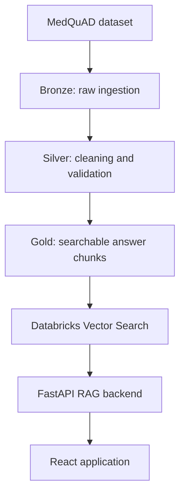

# MedQuAD RAG Assistant

A Databricks-based Retrieval-Augmented Generation application that transforms the MedQuAD dataset into a validated and searchable medical knowledge base.

The project uses a Bronze, Silver, and Gold data pipeline, Databricks Vector Search, a FastAPI backend, a React frontend, and MLflow Tracing. Answers are generated only from retrieved MedQuAD content and include links to the original sources.

> This project is intended for educational and informational purposes. It is not a substitute for professional medical advice, diagnosis, or treatment.

## Architecture



## Main features

- Exploratory data analysis and data-quality assessment
- Bronze, Silver, and Gold transformations
- Quarantine of records with missing or unusable answers
- Deterministic question-answer deduplication
- Semantic answer-quality validation with an LLM classifier
- Sentence-aware chunking with overlap
- Hybrid Databricks Vector Search
- Conversation-aware question preparation
- Grounded answer generation with source links
- MLflow tracing for retrieval, generation, and latency inspection
- Automated pipeline refresh and Vector Search synchronization

## Repository structure

```text
.
├── app/
│   ├── backend/              # FastAPI API and RAG service
│   ├── frontend/             # React and Vite frontend
│   ├── app.yaml              # Databricks Apps configuration
│   └── requirements.txt      # Python dependencies
├── databricks/
│   ├── notebooks/
│   │   ├── exploration/      # EDA and classifier evaluation
│   │   ├── observability/    # MLflow experiment setup
│   │   ├── pipeline/         # Bronze, Silver, and Gold transformations
│   │   └── vector_search/    # Vector Search setup, testing, and sync
│   └── resources/            # Databricks Bundle resource definitions
├── docs/                     # Design and column-selection notes
└── databricks.yml            # Databricks Asset Bundle configuration
```

## Data pipeline

### Bronze

The Bronze layer ingests the original MedQuAD data and preserves its source structure for traceability.

### Silver

The Silver layer applies deterministic cleaning and semantic validation:

- normalizes missing values;
- separates records with missing answers;
- repairs selected formatting problems;
- removes identical question-answer duplicates;
- converts multi-value metadata fields into arrays;
- classifies whether an answer is semantically usable.

Rejected records remain available for inspection instead of being silently discarded.

### Gold

The Gold layer prepares the validated data for retrieval:

- divides long answers into sentence-aware chunks;
- preserves limited overlap between adjacent chunks;
- generates stable identifiers for QA pairs and chunks;
- builds `retrieval_text` from the topic, question, and answer chunk;
- preserves source information and other metadata.

## RAG request flow

1. The backend prepares the latest user question.
2. Ambiguous references can be resolved using recent conversation context.
3. Clear questions are converted into one or more focused search queries.
4. Databricks Vector Search performs hybrid retrieval.
5. Duplicate chunks are removed using `chunk_id`.
6. Retrieved chunks are assembled into a grounded context.
7. The model generates an answer using only the supplied context.
8. Source links are returned with the answer.

## Technology stack

- Databricks
- Unity Catalog and Delta Lake
- Lakeflow Spark Declarative Pipelines
- Databricks Vector Search
- Databricks Model Serving
- MLflow Tracing
- PySpark and SQL
- FastAPI
- React and Vite

## Local application setup

### Prerequisites

- Python
- Node.js and npm
- Databricks CLI
- Access to a Databricks workspace containing the required model endpoint and Vector Search index

Authenticate through the Databricks CLI before starting the backend:

```bash
databricks auth login --host <your-databricks-workspace-url>
databricks auth profiles
```

### Install backend dependencies

From the repository root:

```bash
cd app
python -m venv .venv
source .venv/Scripts/activate
pip install -r requirements.txt
```

### Build the frontend

```bash
cd frontend
npm ci
npm run build
cd ..
```

The production frontend is generated in `app/frontend/dist`. The FastAPI backend serves this directory.

### Start the application

From the `app` directory:

```bash
python -m backend.main
```

The application is available locally at:

```text
http://localhost:8000
```

## Configuration

The backend supports the following environment variables:

| Variable | Purpose |
|---|---|
| `MEDQUAD_INDEX_NAME` | Full Unity Catalog name of the Vector Search index |
| `RAG_TOP_K` | Maximum number of retrieved chunks for a focused query |
| `RAG_MAX_SUBQUERIES` | Maximum number of focused queries |

Do not commit Databricks tokens, `.env` files, credentials, virtual environments, build output, or `node_modules`.

## Databricks Bundle validation

The repository contains resource definitions for the MedQuAD data pipeline and the dependent refresh Job.

Validate the configuration with:

```bash
databricks bundle validate -t dev -p <databricks-profile>
```

The Job executes these tasks in order:

1. Refresh the Bronze, Silver, and Gold pipeline.
2. Refresh the Change Data Feed-enabled Vector Search source table.
3. Synchronize the existing Vector Search index.

The Vector Search endpoint and index are infrastructure resources that are created separately. Normal data updates only require pipeline execution and index synchronization.